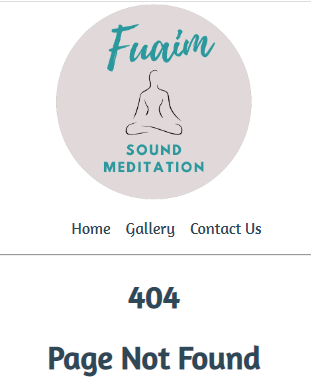

# Fuaim - Sound Meditation 

Fuaim Sound Meditation is a website that offers meditation retreats and courses to interested clients. The website contains information on the benefits of mediation and contact info to be used by prospective clients. 
Live site available [here](https://murph25.github.io/Project_1/).

## Features
### Site wide
- Navigation 
    - Located at the top of pages, it contains links to Home, Gallery and Contact Us.
    -Allows for easy navigation of website. 

  

- Footer
    -Contains social media icons that link to the social media websites.
    -Users will be able to connect with the company on social media platforms.

  

- Favicon 
    -Company logo will display on tabs to make the website tab easy to identify

    

- 404 Page
    - 404 page will display if a link is not working.

    

### Home Page
    -Contains information on the benefits and rewards of meditation. 
    -The websites purpose is to offer interested clients a way to contact the owner to avail of services provided. 
    
  

### Contact Us
    - Users can contact site owner using form. 
        - First name 
        - Last name
        - Email
        - Subject
    - Supports users in contacting owner about sound meditation courses and retreats. 

  

### Gallery 
    - Gallery shows images of clients on retreats and trainings.

  

 ### Features to Implement
    - Add client testimonials on Homepage under "why meditate"

 ## Testing
 ---
 I thank I have fixed any bugs that I am aware of so far, mainly through trial and error.
 All links are working and the form takes the appropriate inputs. 
 I have tested the website on chrome, firefox and edge browsers and appear to all work appropriately.

 ## Validator Testing
 ---
    -HTML
        -No errors were found in testing.

    -CSS
        -No errors were found in testing.

    -Lighthouse
        -Accessibility score of 100.
        -Performance score of 93.

 ## Technologies

  - HTML was used to develop structure of the site

  - CSS was used to style the site.

  - Font Awesome was used for icons

  - Convertio/tinypng - was used to convert images to smaller sizes

  - Favicon was used to create tab logo

  - Balsamiq was used to design the site layout

 ## Deployment
---
    -Website deployed on Github and written on Gitpod.
        - In Git hub Repository go to settings
        - Navigate to 'pages' and select 'main' from 'branch' dropdown menu.
        - Click save.
        - After a few minutes the link will be available
        -Here is the live link : https://murph25.github.io/Project_1/

 ---
 ## Credits
    - Youtube channel Kevin powell - for various supports in understanding ideas and concepts
    - W3C - for understanding concepts and problem solving
    - Wikipedia - Content on meditation for the website
    - pexels.com - for free images
    - typ.io - for selecting fonts to use
    - Canva - to create logo
    - colormind.io - for selecting colours

